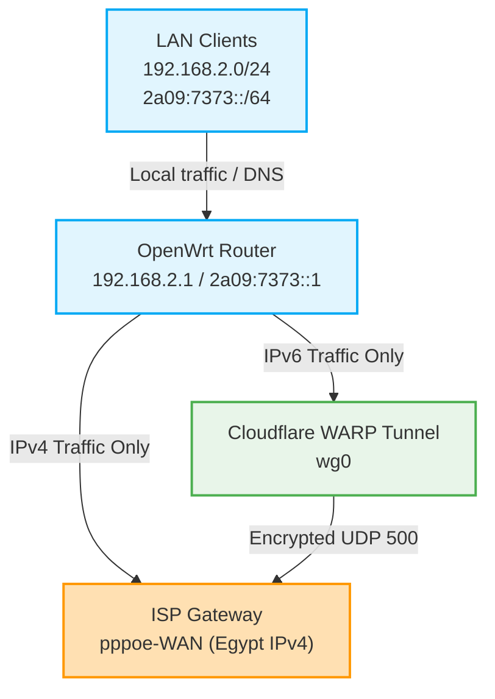
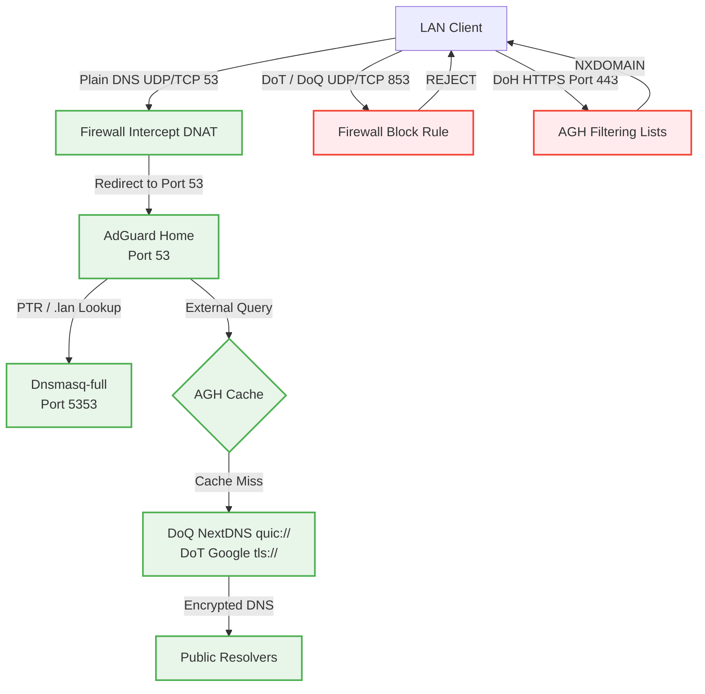

# 🔬 Project OasisEdge: Master Architecture & Security Blueprint

This document serves as the master architectural blueprint and security specification for **Project OasisEdge**—a highly optimized, dual-stack OpenWrt gateway implemented on the Allwinner-powered OrangePi Zero 3. 

Developed as a lifetime production system, **Project OasisEdge** specifically targets the challenges of single-stack regional infrastructures (such as Egypt), establishing a highly private, secure, and resilient dual-stack home network where native IPv6 support is completely absent.

---

## 🇪🇬 The Egyptian Context: Bypassing Single-Stack Limits

In Egypt, mainstream Internet Service Providers (ISPs) operate exclusively on legacy **IPv4 single-stack backbones**. Dynamic IP allocations and PPPoE endpoints do not support native IPv6, leaving local home networks isolated from modern dual-stack services and features. 

**Project OasisEdge** overcomes this regional bottleneck through a custom-routed, low-overhead encrypted IPv6 transition architecture:

*   **The Oasis Bridge:** By establishing a high-speed Cloudflare WARP WireGuard tunnel (`wg0`) exclusively for IPv6 (`::/0`), the router creates a virtual IPv6 gateway.
*   **Encapsulated Transit:** All outbound local IPv6 traffic is wrapped in standard WireGuard UDP headers on port 500 and routed securely over the native ISP IPv4 PPPoE network to Cloudflare's global edge network.
*   **Total ISP Blindspot:** Because all IPv6 packets are fully encrypted before leaving the router, the Egyptian ISP has **zero visibility** into your IPv6 browsing activity, domain queries, or destinations. They only see encrypted UDP packets traveling to Cloudflare, ensuring absolute network privacy and security.

---

## 🏗️ 1. Hardware & Operating System Stack

*   **Processor:** Allwinner H618 (Quad-Core ARM Cortex-A53 @ 1.416 GHz)
    *   *Governor Optimization:* Locked to `performance` on all 4 cores to eliminate CPU frequency scaling latency, maintaining a highly stable and cool thermal footprint (~45.1°C).
*   **Memory:** 2 GB DDR4 RAM (only ~103 MB used, leaving 95% free as a fast buffer).
*   **Storage:** 64 GB Class 10 High-Speed MicroSD card.
*   **Operating System:** OpenWrt 25.12.4 (Stable Release, Linux Kernel 6.12.87, using the modern `apk` package manager).

---

## 🌐 2. Dual-Stack Network & Routing Architecture

The router implements an advanced, asymmetric dual-stack routing design designed to maximize privacy, isolate local traffic, and route IPv6 securely.



### 🛣️ Routing Path Matrix
1.  **IPv4 Path:** Configured as a "one-arm" configuration where PPPoE (`pppoe-WAN`) is established over the bridge `br-lan`. IPv4 traffic routes directly through the Egyptian ISP gateway, with DNS resolved securely using encrypted protocols to hide domain queries from the ISP.
2.  **IPv6 Path:** Routed completely through the Cloudflare WARP WireGuard tunnel (`wg0`). The default IPv6 route (`::/0`) is bound exclusively to `wg0`. Your ISP has zero visibility of your IPv6 traffic.
3.  **Remote Access (WireGuard Server):** An inbound WireGuard server (`wg1`) is configured on listening port `51820` for remote client access to LAN resources, utilizing DuckDNS (`YOUR_DDNS_DOMAIN.duckdns.org`) for dynamic domain resolving.

### 🛡️ Core Routing Protections
*   **Dynamic Route Management:** Redundant manual static routes were pruned. Route management relies on WireGuard’s native `route_allowed_ips '1'` to dynamically configure the tunnel route (`default dev wg0 metric 1024`), ensuring atomic cleanups if the interface toggles.
*   **Path MTU Discovery (PMTUD) Bypass:** The Router Advertisement (RA) MTU is locked to `1280` (minimum IPv6 MTU). This forces all IPv6 clients to send packets limited to 1280 bytes, fitting comfortably within the `1420` WireGuard tunnel without triggering PMTUD failures, black-hole connections, or packet fragmentation.

---

## 🔒 3. Air-Tight DNS Interception & Encryption Layer

The DNS resolution path is designed to be airtight, stopping all forms of local DNS bypass, enforcing complete DNS encryption, and protecting local hardware storage.



### ⚙️ Architectural DNS Specifications
*   **DNS Redirection:** All local UDP/TCP port 53 packets are captured and forced into AdGuard Home (running on port 53). Port 853 (DNS-over-TLS/QUIC) is strictly blocked by the firewall to prevent encryption bypasses.
*   **Encrypted Upstream Resolving:** AdGuard Home queries NextDNS over **QUIC (DoQ)** (`quic://YOUR_NEXTDNS_ID.dns.nextdns.io`) and Google over **TLS (DoT)** (`tls://8.8.8.8:853`). Upstreams are resolved in `parallel` for the lowest latency (cached lookups average `0-1 ms`).
*   **Dual-Stack Resilient Bootstrapping:** AdGuard Home uses a quoted, 6-IP anycast bootstrap list to resolve encrypted upstreams securely on boot, with IPv6/IPv4 and Cloudflare fallbacks:
    ```yaml
    bootstrap_dns:
      - "45.90.28.0"
      - "45.90.30.0"
      - "2a07:a8c0::"
      - "2a07:a8c1::"
      - "1.1.1.1"
      - "8.8.8.8"
    ```
*   **Router System DNS Secured:** The WAN interface is pointed to local loopback (`127.0.0.1`) as the primary nameserver, with `1.1.1.1` as a secure backup. This ensures the router's own resolutions (DDNS updates, package downloads) are encrypted via AdGuard Home.
*   **MicroSD Hardware Protection (RAM Logging):** Since `/var` is a symbolic link pointing to `/tmp` (RAM-backed `tmpfs`), AdGuard's entire active directory `/var/lib/adguardhome/` runs in RAM. This protects the physical SD card from continuous writes and provides an airtight **privacy shield** (query logs vanish from physical memory on power-off).

---

## 🚫 4. Multi-Layer VPN Blocking & Whitelist Architecture

The router implements an enterprise-grade, 3-layer blocking stack to prevent local devices from using VPN tunnels to bypass parental controls or network filters, while maintaining strict whitelisted paths for core services.

### 🧱 The 3-Layer Blocking Stack
1.  **Layer 1 (Protocol & Port Blocks):** The firewall blocks standard outbound VPN ports and protocols originating from the LAN zone:
    *   *WireGuard:* UDP `51820`, `51821`
    *   *OpenVPN:* TCP/UDP `1194`, `1195`
    *   *IPSec (IKEv2/NAT-T):* UDP `500`, `4500`
    *   *PPTP / L2TP:* GRE (Protocol 47), ESP (Protocol 50), UDP `1701`
2.  **Layer 2 (DNS Domain Blocking):** AdGuard Home is configured to return `NXDOMAIN` for **35 major VPN domains** (e.g., NordVPN, ExpressVPN, Surfshark, Mullvad, and Cloudflare client/warp domains). VPN clients are stopped from even resolving server IP addresses.
3.  **Layer 3 (Dynamic IP Blocking - `dnsmasq-full`):** If a device attempts to bypass DNS or resolve a VPN domain, the upgraded `dnsmasq-full` binary (compiled with native `nftset` support) dynamically inserts the resolved IP address into the `vpn_block` nftables set:
    ```properties
    nftset=/nordvpn.com/4#inet#fw4#vpn_block
    ```
    The firewall rule `Block-VPN-IPs` immediately drops all outgoing traffic targeting IPs in this set.

### ⚪ Approved Whitelist Exceptions
To prevent disruptions to system operations, key services are whitelisted in AdGuard Home's custom user rules:
*   `@@||dns.google^` (Required for Google Services connectivity checks)
*   `@@||mtalk.google.com^` & `@@||alt*.mtalk.google.com^` (Allows Google Push Notifications and Android Messages to function)

---

## 🎯 5. Port 443 VPN Evasion Countermeasures & Limitations

Since sophisticated VPN protocols can run over HTTPS port 443 to mimic secure web traffic (e.g., WireGuard-on-443, Stealth VPNs, and WebSockets), we deployed **four advanced traffic evasion countermeasures** to throttle and disrupt them.

### ⚡ Evasion Throttling Mechanisms
```
                   [ Outgoing TCP Port 443 Traffic ]
                                   │
                        Is Connection > 50 MB?
                        ├─── No ───> [ Normal Speed (Unthrottled) ]
                        └─── Yes ──> [ Mark Packet: 0x1 ]
                                          │
                                    [ Traffic Control ]
                                          │
                                 [ Throttle to 512 Kbps ]
```

1.  **UDP 443 Block (QUIC/WireGuard Killer):** Rejects all outbound UDP port 443 traffic from LAN. This instantly blocks QUIC-based VPNs and WireGuard running on 443. *Browsers automatically fall back to HTTP/2 over TCP seamlessly, keeping web browsing unaffected.*
2.  **Long-Lived TCP 443 Throttling (nftables mangling):** Custom nftables conntrack rules monitor active connections. If a *single* TCP connection on port 443 transfers more than **50 MB** (`ct bytes > 52428800`), it is marked as `0x1`:
    ```nft
    nft add rule inet fw4 vpn_throttle iifname "br-lan" tcp dport 443 ct bytes > 52428800 meta mark set 0x1
    nft add rule inet fw4 vpn_throttle iifname "br-lan" tcp sport 443 ct bytes > 52428800 meta mark set 0x1
    ```
3.  **Shaping Marked Connections (Traffic Control - `tc`):** A custom HTB queue discipline on `br-lan` filters marked packets (`0x1`) and restricts them to a dial-up rate of **512 Kbps**, rendering VPN streaming and browsing unusable while leaving short-lived HTTPS web queries unthrottled.
    ```bash
    tc class add dev br-lan parent 1: classid 1:20 htb rate 512kbit ceil 512kbit
    tc filter add dev br-lan parent 1: protocol ip handle 0x1 fw classid 1:20
    ```
4.  **Conntrack Timeout Clamping:** Established TCP connections on port 443 have their conntrack timeout clamped from the standard 2+ hours down to **5 minutes (300 seconds)**:
    ```nft
    nft add ct timeout inet fw4 vpn_short { protocol tcp; l3proto ip; policy = { established: 300, close_wait: 10, close: 10 }; }
    ```
    This drops inactive or idle VPN tunnels every 5 minutes, forcing constant client reconnects and disrupting the user experience.

### ⚠️ Honest Technical Limitations (What cannot be blocked)
*   **Shadowsocks/V2Ray Obfuscation:** While heavily throttled to 512 Kbps and dropped every 5 minutes, these tools mimic normal HTTPS traffic structures and cannot be fully blocked without enterprise Deep Packet Inspection (DPI) hardware.
*   **Custom SSH Tunnels (Port 22):** SSH tunnels on port 22 bypass these rules. Blocking port 22 entirely would break legitimate administrative SSH access.
*   **Hardcoded IPs (No DNS):** Tunnels connecting to hardcoded, unlisted VPN IP addresses that bypass DNS resolution entirely will only be caught by the 50 MB conntrack byte counters once active.

---

## 🎛️ 6. Queue Management & Traffic Shaping (SQM Cake)

To eliminate bufferbloat and guarantee low-latency gaming and VoIP under heavy network load, SQM Cake is deployed on the raw WAN.

*   **Ingress shaping:** `54,000 Kbit` (down) | **Egress shaping:** `9,200 Kbit` (up)
*   **Synergy with TCP BBR:** The egress queue is optimized with `ECN` enabled (`ingress_ecn ECN`, `egress_ecn ECN`), working in perfect synergy with the kernel's BBR congestion control algorithm (`tcp_congestion_control=bbr`) to signal congestion via packets rather than drops.
*   **ACK Filtering:** Upload queue utilizes `ack-filter` (`eqdisc_opts 'ack-filter'`), which drops redundant TCP ACK packets on your 9.2 Mbps upload, preventing it from bottlenecking during high-speed downloads.
*   **Flow Offloading Disabled:** Software and Hardware flow offloading are disabled (`0`) in `/etc/config/firewall` to prevent packets from bypassing the Linux qdisc layer, keeping SQM Cake active.

---

## 🔋 7. WiFi Client Battery-Saving Stack

The network layer has been tuned to prevent background broadcast chatter from waking up mobile client radios from power-saving deep sleep.

1.  **Relaxed Router Advertisements (RAs):** RA max intervals are spaced out to **600s (10 minutes)**, min intervals to **200s** (lifetime `1800s`), allowing mobile devices to sleep for minutes at a time without waking up to process broadcast RAs.
2.  **Unicast RAs and NDP Reachability:** Router Advertisement unicast is enabled (`option ra_unicast '1'`), and the broadcasted Neighbor Reachable Time is set to **1 hour** (`option ra_reachable '3600000'`).
3.  **IGMP/Multicast Snooping:** Enabled on the bridge (`option igmp_snooping '1'`), preventing the router from flooding multicast packets to every port and wireless client.
4.  **Kernel Neighbor Cache Relaxation:** Appended custom sysctl entries to extend the router's ARP and NDP base reachable times on `br-lan` to **4 hours** (`14,400,000 ms`). The router remembers MAC mappings for 4 hours, completely eliminating background neighbor polling.
    ```ini
    net.ipv4.neigh.default.base_reachable_time_ms = 14400000
    net.ipv4.neigh.br-lan.base_reachable_time_ms = 14400000
    net.ipv6.neigh.default.base_reachable_time_ms = 14400000
    net.ipv6.neigh.br-lan.base_reachable_time_ms = 14400000
    ```

---

## 🛡️ 8. Project OasisEdge: Advanced Security Hardening Protocols

To make this production network resilient for a lifetime, the system is hardened against local and external intrusion using professional infrastructure security practices:

### 1. Cryptographic SSH Key-Only Authentication (Disable Passwords)
By default, OpenWrt allows admin logins via standard passwords over SSH, making the router vulnerable to brute-force attacks if a local client is compromised.
*   **Hardening Action:** Upload your public key (e.g. `authorized_keys`) under **System** ➔ **Administration** ➔ **SSH Keys**.
*   **Enforce Key-Only Login:** Under `/etc/config/dropbear`, disable password logins and root password access:
    ```ini
    config dropbear
            option PasswordAuth '0'
            option RootPasswordAuth '0'
            option Port '22'
    ```
    This guarantees that **only** authorized physical devices holding the private SSH key can access the router's operating system shell.

### 2. Complete WAN-Side Portal Isolation (Management Interface Blocking)
To prevent your public IP from exposing access points to the web:
*   By default, the firewall rejects all incoming connections on the `wan` zone. 
*   **Airtight Constraint:** Never add firewall exceptions for Port 80, 443, 8080 (AdGuard UI), or 22 (SSH) on the WAN zone. Remote administration must **only** be performed by establishing a secure handshake with the WireGuard server (`wg1`), placing you virtually in the `lan` zone before opening any admin dashboards.

### 3. DNS Rebind Protection (Anti-Rebinding Attacks)
A compromised local client or browser script could try to abuse your local dnsmasq configuration to translate external malicious sites to local resources (like your router GUI at `192.168.2.1`).
*   **Hardening Action:** Ensure DNS Rebind Protection is strictly enabled under your DHCP/DNS configurations:
    ```ini
    config dnsmasq
            option rebind_protection '1'
            option rebind_localhost '1'
    ```
    This completely rejects public DNS answers that point to private IP subnets (`192.168.x.x`, `127.x.x.x`, `10.x.x.x`), blocking DNS rebinding exploits.

### 4. SSH Idle Connection Auto-Termination
To prevent lingering active shells on admin machines:
*   **Hardening Action:** Dropbear is configured with a strict idle connection verification. If an admin disconnects or leaves their console open, the session is terminated within 5 minutes:
    ```ini
    config dropbear
            option IdleTimeout '300'
    ```

🌐 *Your home dual-stack gateway is now officially codified and secured under the **Project OasisEdge** architecture!*
